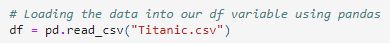
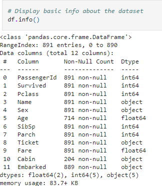
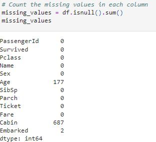
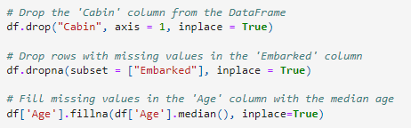
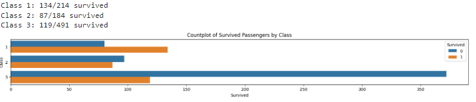
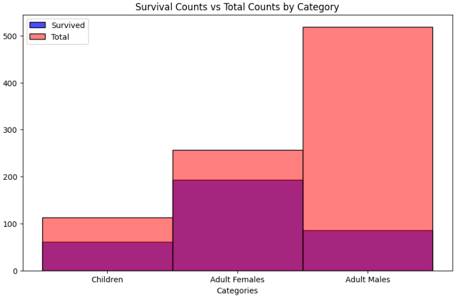
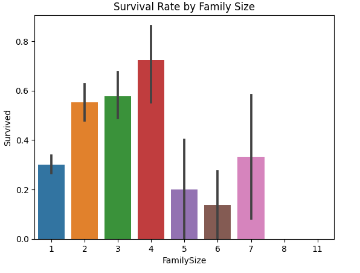

# README for Exploratory Data Analysis (EDA) on Titanic Dataset

## Table of Contents:

### Description
This Jupyter Notebook (titanic.ipynb) conducts an in-depth exploratory data analysis on the Titanic dataset. The analysis explores various aspects of the dataset, including passenger demographics, survival rates, and factors influencing survival. Visualizations such as histograms, bar plots, and scatter plots are used to gain insights into the dataset.

Learning EDA is essential for anyone involved in data analysis, machine learning, or data-driven decision-making processes. It forms the basis for more advanced statistical and machine learning techniques and ensures robust understanding and interpretation of data.

### Installation
Clone the repository:

**git clone https://github.com/EuMYTH/codingTasks/tree/main/T15_Exploratory_Data_Analysis**

**cd T15_Exploratory_Data_Analysis**

Make sure you have the following libraries installed:

**pandas**

**missingno**

**matplotlib**

**seaborn**

### Usage
Ensure you have installed the required libraries as mentioned in the Installation section.

Open and run the **titanic.ipynb** Jupyter Notebook using Jupyter Notebook or Jupyter Lab.

Navigate through the notebook cells sequentially to understand the EDA process and view the visualizations generated.

**Step 1: Load the Dataset**

Step 2: Data Cleaning and Exploration

Step 3: Visualization

### Credits
**Author: Aurel Patriche**

**GitHub Profile: https://github.com/EuMYTH**

